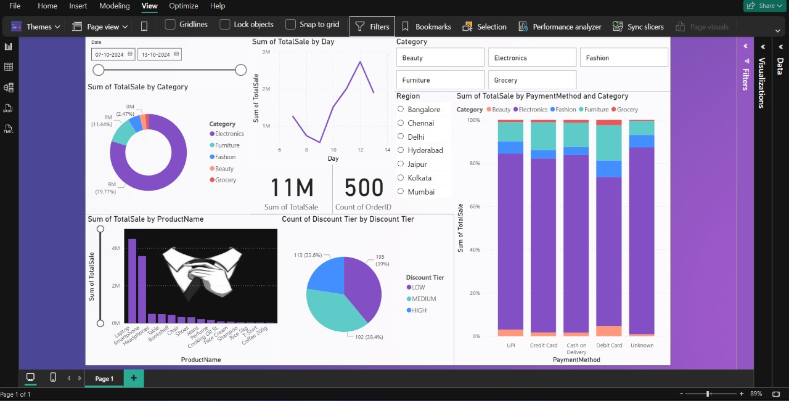

# Flipkart-Big-Billion-Days-Sales-Dashboard  

**Flipkart Big Billion Days Sales Dashboard built in Power BI.**  
This project features interactive visuals for revenue trends, top products, category contributions, regional sales, payment preferences, and discount tiers. Data cleaning and transformation were performed in Power Query, with calculated columns and slicers enabling dynamic filtering and actionable business insights.  

---

## 📊 Dashboard Preview  

---

## 🚀 Key Features  
- Revenue trend analysis to identify peak sales days  
- Top-selling product and category contribution insights  
- Region-wise revenue distribution and payment method preferences  
- Discount tier analysis with conditional columns  
- Interactive slicers for category, region, and date filtering  

---

## 🛠 Tools & Technologies  
- **Power BI** (Report building, data modeling, visualization)  
- **Power Query** (Data cleaning, transformation, calculated columns)  

---

## 📌 Insights  
- Electronics emerged as the dominant revenue driver  
- UPI was the most preferred payment method  
- Medium discount tiers contributed significantly to sales  
- Peak sales occurred around mid-event days  

